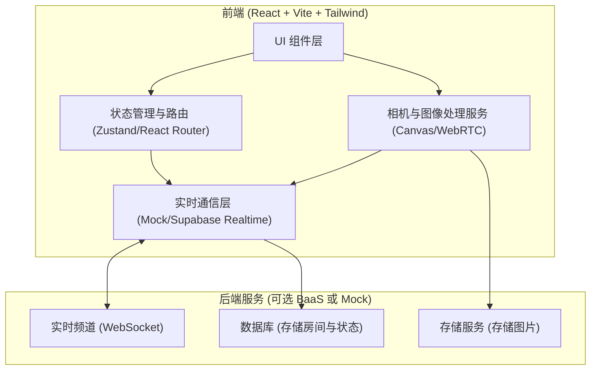
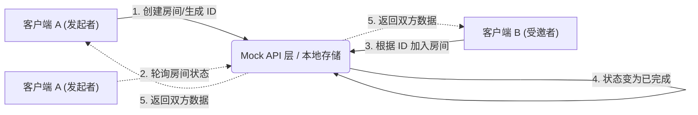
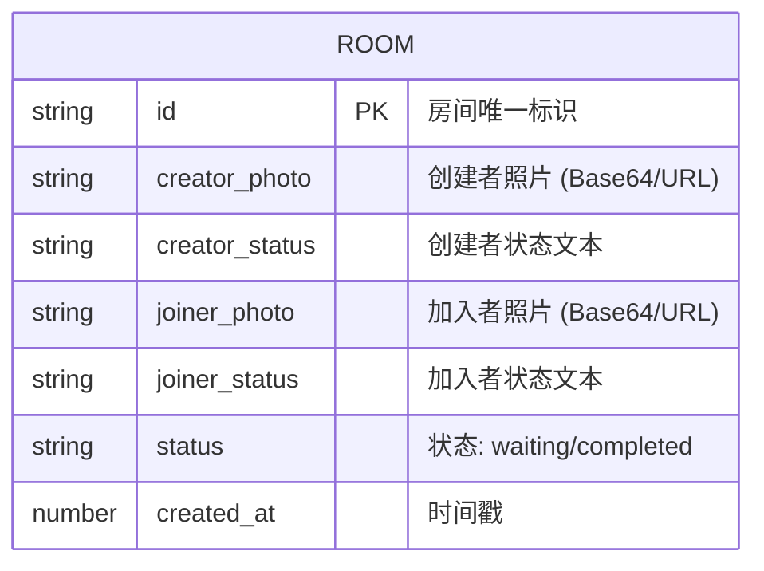

## 1. 架构设计


## 2. 技术说明
- 前端：React@18 + tailwindcss@3 + vite
- 初始化工具：vite-init (或 npm create vite@latest)
- 路由：react-router-dom
- 状态管理：zustand
- 图像处理：HTML5 Canvas API (用于拼接两张照片、应用滤镜并叠加文字)
- 动画库：framer-motion (实现页面丝滑切换、极简呼吸动效)
- 字体与图标：lucide-react，搭配极简无衬线字体
- 后端与实时通信：为快速实现并最小化外部依赖，开发阶段采用基于 localStorage 和 URL 参数的 **Mock Realtime 服务**，后期可无缝接入 Supabase 或自建 WebSocket 服务以实现真正的异地通信。

## 3. 路由定义
| 路由 | 用途 |
|-------|---------|
| / | 首页，展示应用极简简介与“开始我们的时刻”入口 |
| /create | 拍摄与描述页，获取摄像头权限、拍照并输入状态文本 |
| /wait/:roomId | 邀请与等待页，显示分享链接/二维码，实时等待对方加入 |
| /join/:roomId | 受邀者加入页面，同样进行拍摄与描述 |
| /result/:roomId | 拼图结果页，展示拼接后的电影感双人照，提供下载分享 |

## 4. API 定义 (Mock Backend 接口层)
| 接口方法 | 描述 |
|-------|---------|
| `createRoom(data)` | 创建一个房间，返回包含房间 ID 的邀请链接 |
| `joinRoom(roomId, data)` | 受邀者加入房间，提交自己的照片和文本 |
| `pollRoomStatus(roomId)` | 轮询或监听房间状态，当双方完成拍摄时触发结果页跳转 |
| `uploadPhoto(base64)` | 模拟照片上传，返回虚拟或本地 URL |

## 5. 服务器架构图 (状态同步流)


## 6. 数据模型

### 6.1 数据模型定义


### 6.2 数据定义语言
```javascript
// 基于前端的状态模型类型定义 (TypeScript)
interface Room {
  id: string;
  creatorPhoto: string;
  creatorStatus: string;
  joinerPhoto?: string;
  joinerStatus?: string;
  status: 'waiting' | 'completed';
  createdAt: number;
}
```