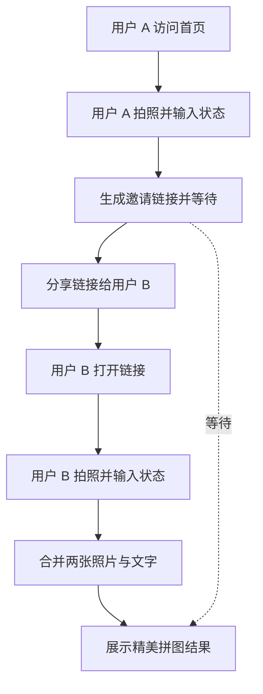

## 1. 产品概述
极简、极美的异地恋双人拍照拼图 Web 应用。
- 主要用途、解决的问题及目标用户：解决异地恋情侣无法同时同地拍照的痛点。提供一个“同时同刻”拍照并自动拼接分享的平台。
- 产品价值：极高的情感连接价值，强烈的社交分享属性，通过精美的拼图结果和带水印的图片实现病毒式传播。

## 2. 核心功能

### 2.1 核心模块
1. **首页 (Landing Page)**: 极简的“创建时刻”入口，强调氛围感。
2. **拍摄与描述页 (Capture & Describe)**: 调用摄像头拍照，输入“我在干嘛”的文字。
3. **邀请与等待页 (Invite & Wait)**: 生成专属链接分享给另一半，并实时等待对方完成拍摄。
4. **拼图结果页 (Result & Share)**: 极美的双人拼图展示，提供一键下载和分享功能，带有品牌水印以实现病毒式传播。

### 2.2 页面详细说明
| 页面名称 | 模块名称 | 功能描述 |
|-----------|-------------|---------------------|
| 首页 | 创建入口 | 极简动画背景，大字体的“开始我们的时刻”按钮。 |
| 拍摄页 | 相机与输入 | 实时相机预览，拍照按钮，极简的文字输入框（“我在...”）。 |
| 邀请页 | 链接生成与等待 | 复制邀请链接，分享给对方；显示心跳动画等待对方加入。 |
| 结果页 | 拼图生成 | 将两张照片左右/上下精美拼接，加上文字排版，提供保存图片功能。 |

## 3. 核心流程
用户 A 进入首页 -> 点击创建 -> 拍照并输入文字 -> 生成专属链接分享给 B -> 用户 A 在等待页等待
用户 B 打开链接 -> 拍照并输入文字 -> 提交
用户 A 和 B 同时进入结果页 -> 看到精美拼图 -> 保存并分享到社交媒体

## 4. UI/UX 设计
### 4.1 设计风格
- 主次色调：极简黑白灰，搭配柔和的环境光晕（如低饱和度的极光渐变色，象征情感连接）。
- 按钮风格：无边框或大圆角毛玻璃效果（Glassmorphism），轻盈且优雅。
- 字体与字号：优雅的现代无衬线字体（如 Inter, Helvetica Neue），关键描述文字使用手写体或衬线体增加情感温度。
- 布局风格：全屏沉浸式，移动端优先（Mobile First），大量留白（Negative Space），拒绝臃肿的传统 UI 框架感。
- 图标/Emoji 风格建议：细线极简图标，避免使用过于花哨的彩色 Emoji。

### 4.2 页面设计概览
| 页面名称 | 模块名称 | UI 元素 |
|-----------|-------------|-------------|
| 首页 | 英雄区 | 满屏环境渐变背景，居中的优雅排版标题，毛玻璃操作按钮。 |
| 拍摄页 | 取景器 | 全屏相机预览，底部悬浮极简输入框（无边框下划线），居中拍摄圆环。 |
| 等待页 | 状态区 | 柔和的呼吸光晕动画，邀请链接卡片，优雅的提示文字。 |
| 结果页 | 拼图展示 | 电影感宽幅/拍立得风格的拼图排版，叠加文字描述，优雅的下载图标。 |

### 4.3 响应式设计
移动端优先设计，适配各种尺寸的手机屏幕；桌面端采用居中的自适应卡片布局或模拟手机界面，两侧采用毛玻璃背景模糊处理，确保跨设备的一致美感。